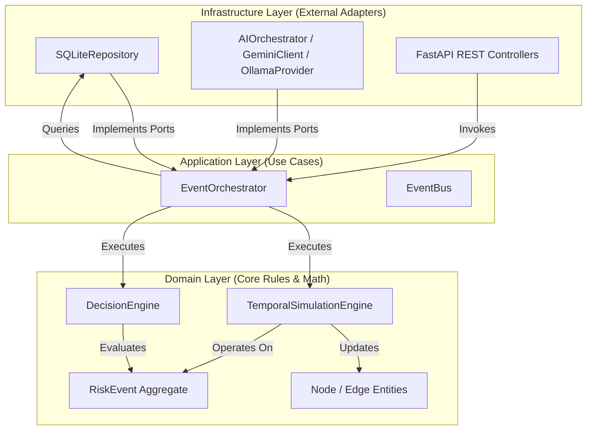

# System Architecture Reference

This document provides a technical walkthrough of the NEXUS platform architecture. Designed around Clean Architecture guidelines, DDD (Domain-Driven Design), and the Ports & Adapters pattern, NEXUS maintains strict decoupling between core resilience math and volatile infrastructure frameworks.

---

## 1. Core Architectural Layout

NEXUS segregates dependencies inward. The Domain layer remains entirely isolated from external databases, AI SDKs, and REST protocols.

---

## 2. Component Design Specifications

### 2.1 Domain-Driven Design (DDD)
-   **Aggregates:** `RiskEvent` forms the transactional boundary. When committed, it drives the downstream state.
-   **Entities:** `Node` (representing infrastructure assets like ports, regional hubs, and operational plants) and `Edge` (representing transit modes and dependency channels).
-   **Value Objects:** `NodeState` and `StepMetrics` snapshot daily coordinates during simulation runs.

### 2.2 Ports & Adapters (Hexagonal Architecture)
Adapters implement abstract interfaces (Ports) declared inside the domain or application layers:
-   **`SupplyChainRepository` (Port):** Implemented by `SQLiteRepository` in the infrastructure layer.
-   **`AIClient` (Port):** Implemented by `AIOrchestrator`, which manages the routing and failover loop across `GeminiProvider`, `OllamaProvider`, and the local `MockProvider` fallback.

### 2.3 Event Bus
NEXUS uses a synchronous, memory-based `EventBus` to link application actions:
-   **`RiskEventCommitted`:** Ingesting a disruption publishes this event, automatically invoking the `TemporalSimulationEngine` downstream.
-   **`SimulationCompleted`:** Triggers the `DecisionEngine` to calculate playbooks and evaluate metrics relative to baseline stockouts.

---

## 3. Mathematical Execution Frameworks

### 3.1 Temporal Simulation Engine
The `TemporalSimulationEngine` executes a discrete-day calculation loop (10-day default):
1.  **Inflow Calculations:** Evaluates inflows for each node on day $t$. For raw inputs (ports, partners), inflow is scaled by the active health metric. For downstream nodes:
    $$\text{Inflow}_i(t) = \sum_{j \in \text{Inbound}(i)} \text{Outflow}_j(t - \text{LeadTime}_{ji}) \times \text{DependencyRatio}_{ji}$$
2.  **Inventory Depletion:** Calculates daily balance transitions:
    $$\text{Inventory}_i(t) = \max(0, \text{Inventory}_i(t-1) + \text{Inflow}_i(t) - \text{Consumption}_i)$$
3.  **Health & Risk Mapping:** 
    - If inventory is above the safety stock threshold: Health = 1.0, Risk = 0.0.
    - If inventory drops below safety stock: Health declines linearly between 0.5 and 1.0.
    - If inventory is depleted: Health = 0.0 (resource starvation), Risk = 1.0.
4.  **Disruption Capping:** If a node is listed in the `active_event.affected_nodes` map, its health is capped at:
    $$\text{Health}_i(t) \le 1.0 - \text{Severity}_i$$

### 3.2 Decision Engine
Evaluates candidate mitigation playbooks using a weighted algebraic utility calculation:
$$\text{Score} = w_{\text{cost}} \times U_{\text{cost}} + w_{\text{delay}} \times U_{\text{delay}} + w_{\text{feasibility}} \times U_{\text{feasibility}}$$
-   **Cost Utility ($U_{\text{cost}}$):** Scales the playbook fee relative to the "do-nothing" baseline financial loss.
-   **Delay Utility ($U_{\text{delay}}$):** Evaluates the lead-time surcharge relative to the warehouse safety buffer threshold.
-   **Feasibility Utility ($U_{\text{feasibility}}$):** The baseline probability of successful playbook deployment.

---

## 4. Frontend Topology Graph
-   **React Flow:** Handles the rendering of nodes and edges, drawing layouts dynamically based on coordinates, direction, and flow.
-   **Active Targets:** Evaluates `isTarget` for each node against the active `affected_nodes` array, rendering warning borders and stockout state details dynamically.
