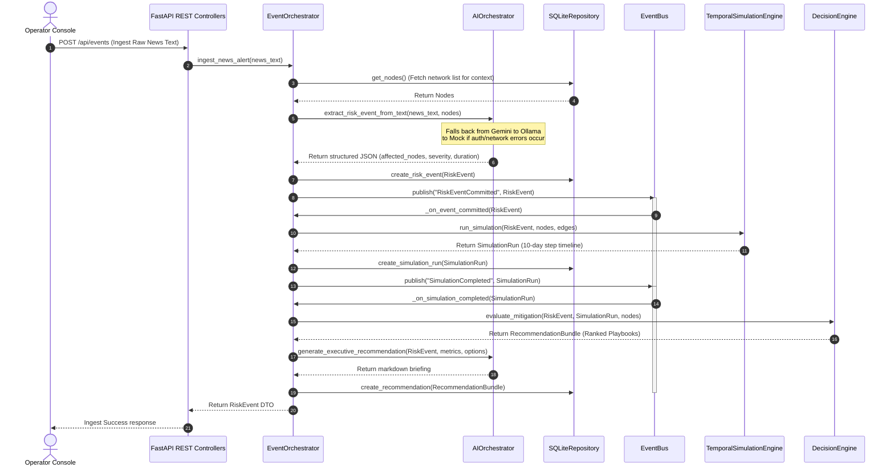
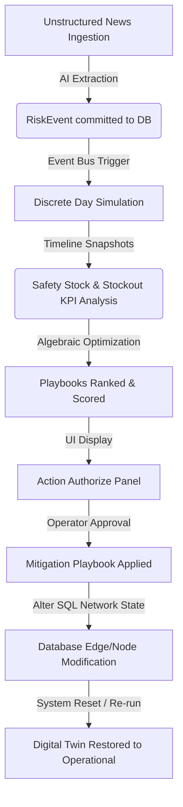

# System Design & Lifecycle Specifications

This document outlines the lifecycles, event flows, and sequence diagrams of the NEXUS platform.

---

## 1. End-to-End Request Lifecycle

The diagram below traces a news bulletin from user submission to database update:

---

## 2. Ingestion to Execution Data Flow

---

## 3. Detailed Component Lifecycles

### 3.1 AI Provider Failover Loop
The AI client utilizes a sequential try-catch retry sequence:
1.  **Stage 1: Google Gemini.** Attempts structured extraction using `gemini-2.5-flash` with response schema enforcement.
2.  **Stage 2: Local Ollama (Fallback).** If cloud keys are missing or rate limits occur, calls `localhost:11434/api/generate` with a Mistral model. If JSON output fails validation, launches an LLM repair prompt.
3.  **Stage 3: Mock Provider (Valve).** If Ollama is offline, matches key phrases inside the news text to return deterministic, high-fidelity mock extraction payloads.

### 3.2 Simulation Lifecycle
The temporal engine evaluates daily steps sequentially:
-   **Day 0:** Reads active baseline nodes and applies health reductions for directly disrupted targets listed in the active event's `affected_nodes`.
-   **Days 1–10:** Loops through each node, processing inflows from inbound paths based on lead times and updating local inventories. Downstream nodes with depleted safety stock see health drops, which automatically scale down their daily production outflows to downstream dependents on subsequent days.
-   **KPI Compile:** Aggregates overall system resilience, delayed unit numbers, and operating costs.
